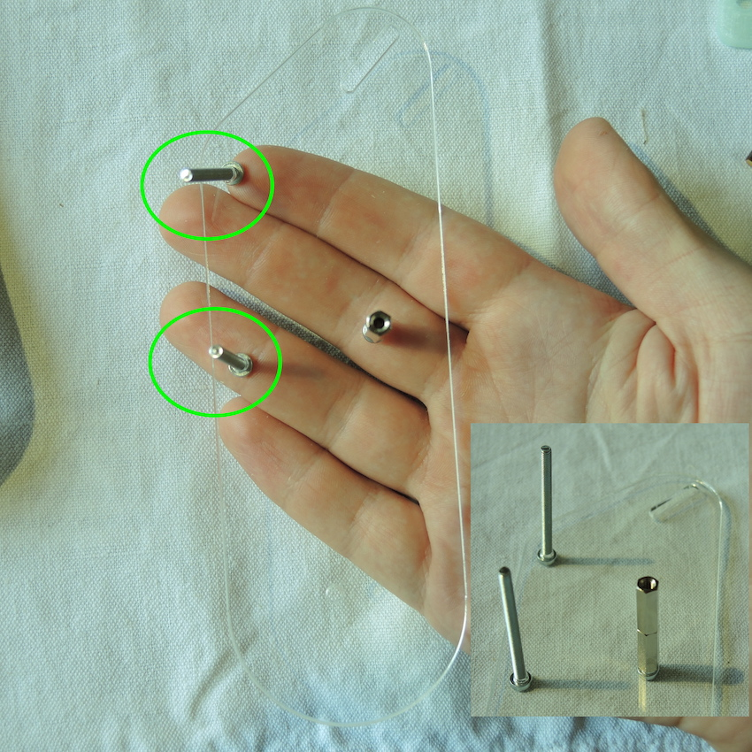
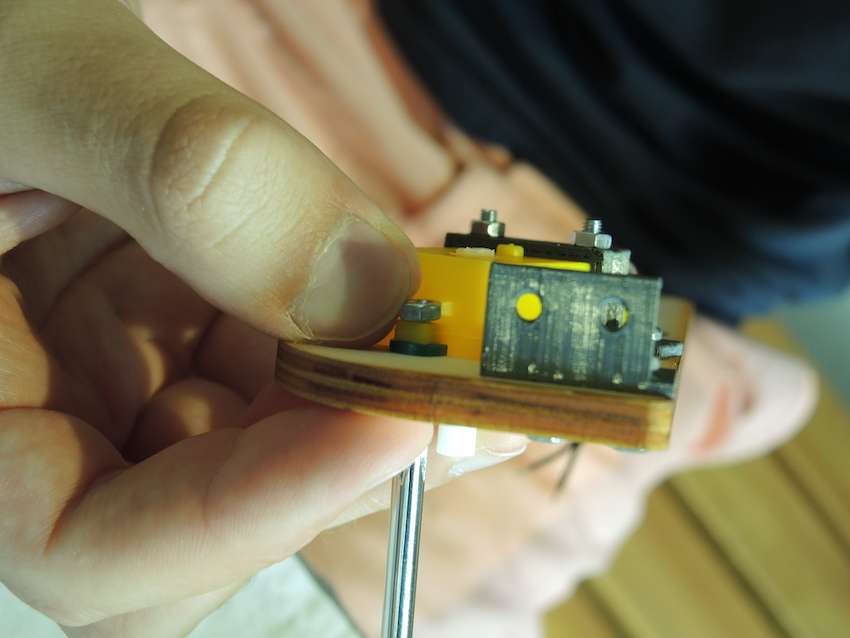

V tomto dokumentu je uveden návod na sestavení mechanických dílů vozítka TrackRay. Část mechanických dílů je vyrobena technologií 3D tisku, část je vyřezána z překližky a plexiskla pomocí laseru, dalším dílem je osazená deska plošných spojů, ostatní součástky tvoří běžně dostupný spojovací materiál. 

___
# Obsah
* [Příprava překližkových dílů](#preklizka)
* [Sestavení velkých kol](#kolo)
* [Sestavení malých kol](#kolecka)
* [Sestavení bočnic #1](#bocnice1)
* [Sestavení bočnic #2](#bocnice2)
* [Kompletace šasi](#sasi)
* [Polepení pásů](#pasy1)
* [Slepení pásů](#pasy2)
* [Nasazení pásů](#pasy3)
* [Kamera](#kamera)
___

## <a name = preklizka>Příprava překližkových dílů</a>
**Nástroje:**
* Smirek

**Postup:**
1. Obruste smirkem všechny nedořezky. 

## <a name = kolo>Sestavení velkých kol</a>
**Potřebné díly:**

* 2x kolo neozubené velké z překližky
* 1x kolo ozubené velké z překližky
* 1x kolo ozubené velké 3D tisk
* 5x matice M3
* 5x šroub M3x22

**Nástroje:**
* Křížový šroubovák
* Maticový klíč

**Postup:**
1. Provléct šroub skrz díru pod malou dírkou. Otočit na opačnou stranu. 

    
1. Navléct ozubené kolo z překližky. Malé dírky musí padnout na sebe. 

    
1. Navléct 3D tištěný díl tak, aby výstupek pro zastrčení osy směřoval směrem od dřevěných dílů. 

    
1. Navléct neozubené kolo z překližky. 

    
1. Zašroubovat matku. Neutahovat.

    
1. Doplnit zbylé šrouby a matky. Díly vystředit vůči sobě. Všechny matky utáhnout maticovým klíčem. 

    
1. Celý postup zopakujeme pro druhé kolo.

    
## <a name = kolecka>Sestavení malých kol</a>
**Potřebné díly:**

* 2x kolo neozubené malé z překližky
* 2x kolo neozubené maličké z překližky
* 1x vymezovač kola 3D tisk
* 3x matice M3
* 3x šroub M3x22

**Nástroje:**
* Křížový šroubovák
* Maticový klíč

**Postup:**
1. Provléct šroub skrz malé kolo. 

    
1. Navléct maličké kolečko.

    
1. Navléct další maličké kolečko. 

    
1. Doprostřed vložit vymezovač kola z 3D tisku. 

    
1. Navléct malé kolo. 

    
1. Zašroubovat matku. Neutahovat. 

    
1. Doplnit zbylé šrouby a matky. Díly vystředit vůči sobě. Všechny matky utáhnout. 

    
1. Stejným postupem sestavit zbylá kola. Celkově jich bude 6. 

    

## <a name = bocnice1>Sestavení bočnic #1</a>
**Potřebné díly:**
* 2x bočnice z překližky
* 2x plastový držák z 3D tisku
* 4x matice M3
* 4x šroub M3x10

**Nástroje:**
* Křížový šroubovák
* Maticový klíč
* Klíč na distanční sloupky (šedý)

**Postup:**
1. Rozchystat součástky podle nákresu. 

    
1. Umístit držák na Bočnici 2. 

    
1. Skrz Bočnici 2 provléct šrouby a utáhnout matky. 

    
1. Postup zopakujte pro Bočnici 1. 

    

## <a name = bocnice2>Sestavení bočnic #2</a>
**Potřebné díly:**

Díly jsou uvedeny postupně pro každý krok. 

**Nástroje:**
* Křížový šroubovák
* Maticový klíč
* Klíč na distanční sloupky (šedý)

**Postup:**

*Postup je předveden na Bočnici 2*
1. Odlepit z obou stran plexiskla ochranou folii. 

    
1. Rozchystat součástky podle nákresu. 

    
1. Prošroubovat šroub M3x10 skrz bočnici z plexiskla do distančního sloupku M3x30. 

    
1. Protáhnout šrouby M3x40 skrz bočnici z plexiskla. 

    
1. Na šrouby našroubovat distanční sloupky M3x10. Dotáhnout pomocí klíče na distanční sloupky. 

    
1. Přidat šroub M3x45 do pohyblivé drážky a našroubovat distanční sloupek. Nedotahovat, nechat volně. 

    
1. Nasadit kolečka. 

    
1. Našroubovat distanční sloupky. 

    
1. Dotáhnout distanční sloupky u šroubů M3x40 (jsou v kulatých dírách, ne v pohyblivé drážce). 

    
1. Zatlačte matku šroubovákem do dílu z 3D tisku. 

    [alt](SupportFiles/DSCN8417.JPG)
1. Připravte díly dle obrázku. 

    
1. Připevněte šroubem M3x12. 

    
1. Nasuňte motor do otvoru. Zkontrolujte, že máte vše ve shodě s obrázkem. 
    * Bočnici s 3D tištěným dílem.
    * Kabel jde na opačnou stranu bočnice. 
    * Uštípnutý bílý plast na motoru.

    
1. Zkontrolujte, že máte ve shodě s obrázkem. 

    
1. Nasaďte 3D tištěný díl. Obraťte na druhou stranu. 

    
1. Vložte šrouby M3x25 hlavou k motoru. Obraťte na druhou stranu. 

    
1. Přidejte matky a dotáhněte tak, aby nepraskl plastový kryt motoru.

    
1. Protáhněte šroubky M3x10 hlavou K 3D tištěnému držáku. Obraťte na druhou stranu. 

    
1. Přišroubujte matky a utáhněte. 

    
1. Pro upevnění motoru si připravte tyto díly. 

    
1. Vložte podložku z 3D tisku pod očko od motoru. Obraťte na opačnou stranu.  

    
1. Protáhněte šroub M3x16 s vnořenou hlavou. 

    
1. Našroubujte matku a utáhněte. Hlava šroubu by měla být úplně nebo skoro vyrovnaná s plochou bočnice.

    
1. Pro upevnění hnacího kola budete potřebovat tyto díly. Nasaďte kolo na bílý plast motoru. 

    
1. Prošroubujte středem kola černý vrut 2,2x10 a utáhněnte. 

    
1. Protáhněte kabely od motoru na opačnou stranu bočnice. 

    
1. Pro připevnění L - držáku korby budete potřebovat tyto díly. 

    
1. Umístěte držák a protáhněte šrouby M3x10. Otočte na druhou stranu. 

    
1. Přišroubujte matky, utáhněte. 

    
1. Přiložte obě části bočnice. 

    
1. Přichystejte 3 matky M3 a šroub M3x10. Šroub namontujte a utáhněte.

    
1. Matku v posuvné drážce nedotahujte, kolo nechte volně pohybovat. Další matky utáhněte.

    
1. Stejným postupem zkompletujte druhou bočnici. 

    

## <a name = sasi>Kompletace šasi</a>

**Potřebné díly:**

* Zbývající díly z překližky
* 20 matic
* 20 šroubů M3x8

**Nástroje:**
* Křížový šroubovák
* Maticový klíč

**Postup:**
 
 *Šroubovat a utahovat.* **Dodržujte umístění hlav a konců šroubů podle fotek.**

1. Přišroubujte šasi k bočnici. 

    

    

    

    
1. Stejně na druhé straně. 

    
1. Připevněte L - držák z 3D tisku.

    
1. Připevněte zadní kryt korby.

    
1. Připevněte šikmý držák z 3D tisku (tento držák není pod úhlem 90°).

    
1. Připevněte přední kryt korby. 

    
1. Připevněte L - držák z 3D tisku na přepážku z překližky.

    
1. Spojte přepážku s šasi.

    
1. Nachystejte 3D tištěně držáky desky plošných spojů, 2 šrouby M3x8 a 4 matky M3. Matky vložte do 3D tištěných dílů.

    
1. Spojte držáky s šasi.

    

## <a name = pasy1>Polepení pásů</a>

**Potřebné díly:**
* 4x vytištěný kus pásu
* 2 m těsnění do oken
 
**Nástroje:**
* štípací kleště / nůžky
* 3D tištěné měřidlo

**Postup:**

1. Nastříhejte z pryžové pásky nálepku na každý článek pásu. Bude potřeba 72 kusů těsnění. Použijte 3D tištěné měřítko pro odměření velikosti článků. 

    
1. Každý článek pásů polepte. Na těsnění je pod ochrannou fólií samolepící vrstva.

    

## <a name = pasy2>Slepení pásů</a>

**Potřebné díly:**
* 4x 3D tištěné pásy
* kus filamentu
 
**Nástroje:**
* lepidlo na plasty
* nůžky
* kleště
* pravítko

**Postup:**

1. Nastříhejte z filamentu 4 kusy po 0,9 cm.

    
1. Pomocí kleští vsuňte kus filamentu na spojnici mezi pásy.

     
1. Zalepte kus filamentu z obou stran. **Pozor:** Použijte malé množství lepidla, aby se nedostalo do kloubů pásu.

    
1. Lepidlo nechte zaschnout  min. 20 minut. Po tuto dobu s pásy výrazně nehýbejte, nesnažte se je nasadit na robota!

## <a name = pasy3>Nasazení pásů</a>

**Potřebné díly:**
* 2x zkompletované pásy
* 1x zkompletované šasi

**Nástroje:**
* Maticový klíč
* Klíč na distanční sloupky (šedý)
* Šroubovák

**Postup:**

1. Nachystejte potřebné díly. 

    
1. Postupně nasaďte pásy. 

    

    

    
1. Vypněte pás a dotáhněte pohyblivé kolo. 

    

    

## <a name = elektronika>Elektronika</a>

[*Pájení je v samostatném návodu.*](TrackRay_electronics_cz.md)

## <a name = Kamera>Kamera</a>

**Potřebné díly:**
* 1x držák kamery z 3D tisku
* 1x čočka fish-eye
* 1x obdélník stříbrné pásky

**Nástroje:**
* Lepidlo

**Postup:**
1. Našroubujte čočku. **Pozor**: Pohlídejte, aby závit čočky zajel přesně do závitu držáku.

    
1. Naneste malou kapku lepidla na držák kamery.

    
1. Odlepte obdélníkový kus stříbrné pásky z podkladového papírku.

    
1. Přilepte zrcátko.

    
1. Před dalším postupem zavolejte vedoucího.
1. Otevřete konektor pro kameru na ESP-CAM.

    
1. Zasuňte kameru do konektoru na ESP-CAM.

    
1. Kameru namiřte a částečně zasuňte do díry v držáku kamery.

    
1. Držák kamery opatrně nacvakněte shora na ESP-CAM. **Pozor**: Přední část musí být zarovnána s koncem kolíkové lišty jak vyznačuje šipka.

    
1. Zasaďte ESP32 do desky plošných spojů. **Pozor**: dbejte na správnou orientaci a zarovnání kolíkových lišt.

    

