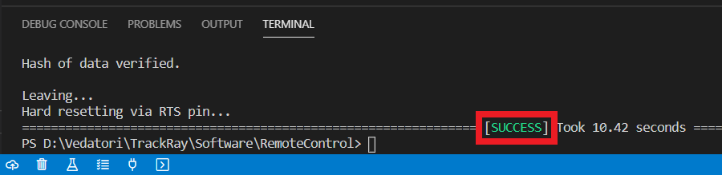
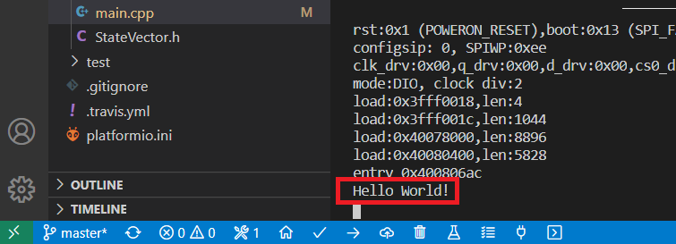

Toto je návod na programování robotického pásového vozidla TrackRay. Začněte instalací vývojového prostředí na váš PC a následně si budeme ukazovat základní pravidla programovacího jazyka C++ na příkladech.

___
# Obsah
* [Vývojové prostředí](#IDE)
* [Dálkové ovládání - kontrola robota](#kontrola)
* [Nový projekt](#novyProjekt)
* [První program](#prvniProgram)
* [Komentáře](#komentare)
* [Proměnné](#promenne)
* [Větvení](#vetveni)
* [Cyklus](#cyklus)
* [Funkce](#funkce)
* [LEDky](#ledky)
* [Tlačítko](#tlacitko)
* [Motory](#motory)
* [Sériová linka](#seriovka)
* [Výpis textu na LED panel](#panelLed)
* [Bzučák a kanón](#buzzerCannon)
* [Gyroskop](#gyroskop)
* [Připojení k WiFi](#wifi)
* [Vzdálený příkazový řádek](#remoteCmd)
* [Kamera](#kamera)
___
## <a name = IDE>Vývojové prostředí</a>

Pro programování TrackRay je použito vývojové prostředí [Visual Studio Code](https://code.visualstudio.com/download) s rozšířením PlatformIO. Pro instalaci prostředí a rozšíření můžete použít tento [návod](https://docs.platformio.org/en/latest/ide/vscode.html#installation), jehož hlavní část je na obrázku níže:


___
## <a name = kontrola>Dálkové ovládání - kontrola robota</a>

V této části nahrajeme do TrackRay předpřipravený program pro jeho otestování. Program umožňuje dálkové ovládání TrackRay pomocí vašeho chytrého zařízení.

1. Pro naprogramování TrackRay si stáhněte [sbírku příkladů](https://github.com/vedatori/TrackRay-examples/archive/master.zip). Stáhnutý soubor *TrackRay-examples-master.zip* si rozbalte na disk svého PC na libovolnou lokaci tak, abyste ho našli. 
**Pozor:** PlatformIO má chybu - nedokáže pracovat s diakritikou v cestě k projektu. Všechny projekty musí být uloženy v cestě bez háčků a čárek!
Pokud vaše uživatelské jméno obsahuje diakritiku, tak nemůžete používat Plochu ani složku Dokumenty, ale musíte vytvořit například *C:/Vedatori/TrackRay-examples-master*.

1. Ve VS Code otevřete nabídku *File*, klikněte na *Open Folder* a zvolte složku *RemoteControl* z dříve rozbalené sbírky příkladů *TrackRay-examples-master*.

    
1. Otevřete soubor *main.cpp* který je v cestě *RemoteControl/src/main.cpp*.

    
1. Na řádku 11 upravte název robota "TrackRay" tak, aby byl poznatelný, např. ve formátu "TrackRay_jmeno". Můžete upravit i heslo, ale pozor, aby mělo alespoň 8 znaků.

    
1. Po otevření projektu bude VS Code chvíli pracovat. Pokud ještě pracuje, počkejte, dokud text na dolní liště nezmizí.
   
    
1. Připojte TrackRay pomocí USB Mini B kabelu k PC.
1. V dolní liště PlatformIO stiskněte šipku a tím nahrejte program do TrackRay.

    
1. Počkejte, až se dokončí nahrávání a zobrazí v dolním terminálu *SUCCESS*.

    
1. V dolní liště PlatformIO stiskněte tlačítko úplně v pravo a tím spusťe PlatformIO terminál.

    
1. Do nově otevřeného termínálu v dolní částí VS Code zadejte příkaz 'pio run -t uploadfs' a stiskněte *ENTER*.

    
1. Počkejte, až se dokončí nahrávání a zobrazí v dolním terminálu *SUCCESS*.

    
1. Nyní je robot plně naprogramován. Pro ovládání na svém chytrém zařízení vyhledejte WiFi síť s názvem *TrackRay* nebo s vámi zvoleným jménem a heslem. Podle typu vašeho zařízení vám pak může vyskočit tlačítko na přihlášení do sítě "Sign in" jako např. pro Android:

    
1. Pokud se žádná výzva k přihlášení neobjeví, zadejte do webového prohlížeče adresu *192.168.4.1* nebo jakoukoli jinou ve tvaru *www.neco.cz*. Načte se hlavní stránka pro ovládání TrackRay. Joystickem ovládejte pohyb. Na počítači můžeš použít šipky. Do políčka *Command entry* zadávejte speciální příkazy.

    
1. Pro přihlášení TrackRay k externí WiFi síti klikněte na tlačítko *WiFi setup*. Na následující stránce zadejte přihlašovací údaje od externí WiFi a potvrďte přihlášení.

    
1. Pokud přihlášení proběhne úspěšně, objeví se potvrzení *connected* a přidělená IP adresa. Tato síť bude vyhledána i po restartu. Připojte se svým chytrým zařízením také na externí WiFi a zadejte do prohlížeče přidělenou IP adresu. V tomto případě *192.168.1.152*. Tato adresa bude po restartu zobrazena i na panelu TrackRay. 

    
1. Načte se opět hlavní stránka ovládání TrackRay. Tímto je vypnuta interní WiFi *TrackRay_jmeno*. Pro její opětovné zapnutí přejděte do nastavení WiFi a klikněte na tlačítko *Enable AP* nebo restartujte TrackRay.

    
1. Pro ovládání TrackRay textovými příkazy z dema *RemoteControl* můžete používat následující příkazy. Příkazy nejsou citlivé na velikost použitých písmen.
    * `flash on` - Zapne přední reflektor na plný výkon. Pozor, LED je poměrně silná. Nedoporučejeme používat příliš dlouho. Může dojít k *utavení* plastového držáku zrcadla a čočky.
    * `flash half` - Zapne přední reflektor na poloviční výkon
    * `flash off` - Vypne přední reflektor
    * `flash 49` - Zapne přední reflektor na 49% výkon. Můžeš poučít libovolné celé číslo <0, 100>.
    * `cam on` - Zapne kamerový přenos z TrackRay.
    * `cam off` - Vypne kamerový přenos.
    * `shoot` - Vystřelí čili zapne motor děla na 1 vteřinu.
    * `beep` - Zapne buzzer na 0,5 vteřiny.

___
## <a name = novyProjekt>Nový projekt</a>

Vytvoříme nový projekt a nahrajeme program do TrackRay.

1. Vytvoř si na disku svého PC složku pro tvé budoucí programy, například *C:/Vedatori/TrackRay-moje-programy*.
1. Do této nové složky překopíruj složku *demo_project* ze sbírky příkladů *TrackRay-examples-master*. Tato složka *demo_project* bude sloužit jako šablona tvých budoucích programů pro TrackRay. 
1. Překopírovanou složku *demo_project* přejmenuj na *01_prvni_program*.
1. Ve VS Code otevři složku *01_prvni_program* pomocí *File*->*Open folder*.
1. Připojte TrackRay pomocí USB Mini B kabelu k PC.
1. V dolní liště PlatformIO stiskněte šipku a tím nahrejte program do TrackRay.
    
1. Počkejte až se dokončí nahrávání a zobrazí v dolním terminálu *SUCCESS*.
    

___
## <a name = prvniProgram>První program</a>
Otevři si soubor *main.cpp*. Programovat robota budeme hlavně v tomto souboru. Nahraď celý jeho obsah následujícím minimálním kódem:
```
#include "TrackRay/TrackRay.h"

void setup() {
    trrBegin();
    trrSetLedDigital(D1, true);
}

void loop() {
    
}
```

1. `#include "TrackRay/TrackRay.h"` - Příkaz *#include* značí co všechno můžeš ve svém programu používat. Nyní nám bude stačit přidání knihovny *TrackRay.h*.
1. `void setup() {}` - To, co vidíš zde, je funkce. Funkce jsou kusy kódu, které můžeš opakovaně spustit tak, že zavoláš jméno. Kód každé funkce je ohraničen složenými závorkami { a }, a uvnitř také odsazen. Tato funkce se jmenuje *setup* a je spuštěna jedenkrát po zapnutí TrackRay.
1. `trrBegin();`
1. `void loop()` - Tato funkce se jmenuje *loop* a je spouštěna stále pořád dokola dokud je TrackRay zapnutý.

### Tvůj kód
Nyní napíšeš svůj první vlastní program na TrackRay. Na příslušné místo v tvém kódu přepiš řádek `trrSetLedDigital(D1, true);`. Tento řádek patří na konec funkce *setup*, tedy před uzavírací závorku }.

Všimni si, že při psaní ti VS Code napovídá. Stačí napsat *trr* a uvidíš všechny metody, které můžeš používat na řízení TrackRay. Pokud se tak nestane, nabídku vyvoláš stisknutím *Ctrl + Space*.


Funkce *trrSetLedDigital* slouží k zapínání a vypínání LED světel na TrackRay. Jedná se o volání funkce s parametry v kulatých závorkách ( a ).
1. parametr udává kterou LED chceme ovládat. V tomto případě budeme ovládat LED úplně vlevo nahoře, která se jmenuje *D1*.
1. parametr udává jestli má LED od nyní svítit (`true`) nebo nesvítit (`false`).

Nahraj program do TrackRay a počkej až se první LED rozsvítí. Gratulujeme, toto byl tvůj první vlastní program pro TrackRay :-)

___
## <a name = komentare>Komentáře</a>

Do svého kódu je někdy vhodné psát komentáře. Komentáře jsou kusy textu, které jsou viditelné pro programátora, čili tebe, ale TracRay si jich nevšímá. Jsou vhodné zejména v místech, kdy ze samotného funkčního kódu není zřejmé co dělá a k čemu slouží.

V jazyce C++ máme 2 typy komentářů:
1. Jenořádkový komentář je uvozen dvojitým lomítkem `//`. Celý zbytek řádku za dvojitým lomítkem je považován za komentář.
1. Víceřádkový komentář je uvozen lomítkem a hvězdičkou `/*`. Ukončen je hvězdičkou a lomítkem `*/`. Veškerý text mezi je považován za komentář. Začátek a konec mohou být na různých řádcích.

Příklad: Tento program nerozsvítí LEDku.
```
#include "TrackRay/TrackRay.h"

void setup() {
    trrBegin();
    // trrSetLedDigital(D1, true);
}

void loop() {
    
}
```

___
## <a name = promenne>Proměnné</a>

### Motivace
Při psaní programů brzy dojdete k tomu, že potřebujete aby si program něco *zapamatoval*. Může se jednat o výsledek matematicé rovnice, počítadlo kroků, uchování měřené hodnoty a tak dále. K tomuto účelu se v programech používají **proměnné**. Proměnné si můžeme představovat jako šuplíky s textovými popisky na sobě. Do šuplíku můžeme *vložit* nějakou informaci a někdy později ji opět vytáhnout. Popisek šuplíku zde představuje název proměnné.

### Vytvoření proměnné
Proměnnou vytvoříme následujícím příkazem:
```
typ_promenne nazev_promenne = hodnota;
```
`typ_promenne` udává jaký typ informace budeme do proměnné ukládat. Říkáme mu také *datový typ proměnné*. Může to být číslo, text atd.

`nazev_promenne` udává název proměnné, pomocí kterého dokážeme od sebe jednotlivé proměnné odlišit. Proto musí mít každá proměnná svůj jedinečný název. Snaž se pojménovávat proměnné výstižně, tedy např. *rychlost* je mnohem lepší než *prom*. V názvu proměnné můžeš používat znaky anglické abecedy, tj. bez diakritiky, velká a malá písmena, čísla a speciální znaky jako podrtžítko `_`. Podtžítkem můžeme oddělovat slova v názvu jedné proměnné.

`=` je operátor sloužící k přiřazení (vložení) určité hodnoty do proměnné.

`;` čili středník slouží k oddělování příkazů a píšeme ho vždy na konec příkazu. Na české klávesnici se nachází pod klávesou *ESC*.

### Základní datové typy proměnných
* `int` označuje proměnnou pro ukládání celých čísel, například `3`.
* `float` označuje proměnnou pro ukládání desetinných čísel, například `3.14`.
* `char` označuje jeden textový znak -> znak se udává v apostrofech, například `'c'` označuje znak *c*.
* `bool` označuje pravdivostní hodnotu -> *true* pro pravdu a *false* pro nepravdu.
* `std::string` označuje řetězec textových znaků -> řetězec se ohraničuje uvozovkami, například `"Ahoj svete"`.

### Operace s proměnnými

Operace *přiřazení* slouží k uložení dané hodnoty do proměnné. Hodnota, která je napravo od rovnítka `=` je uložena do proměnné uvedené nalevo od `=`: 
```
nazev_promenne = hodnota;
```

Číselné proměnné můžeme sčítat (+), odečítat (-), násobit (*) a dělit (/). 

Příklad:
```
#include "TrackRay/TrackRay.h"

void setup() {
    trrBegin();
    int cele_cislo = 0;
    cele_cislo = cele_cislo + 10;   // Zvýšíme hodnotu v proměnné o 10
    cele_cislo += 10;   // Zkrácený zápis toho stejného
    // Nyní je v proměnné cele_cislo uloženo 20
}

void loop() {
    
}
```

Zde jsou uvedeny příklady vytvoření proměnných zmíněných datových typů a uložení hodnoty do nich.
```
// proměnná pro celá čísla se jménem cele_cislo, ve které je hodnota 0
int cele_cislo = 0; 

// promenna pro desetinne cislo ve které je hodnota 3.14
float desetinne_cislo = 3.14; 

// proměnná znak, do které jsme uložili znak 'a'
char znak = 'a';

// proměnná otevreno, do které jsme uložili hodnotu pravda (true)
bool otevreno = true; 

// proměnná pro textový řetězec s hodnotou "nejaky text"
std::string text = "nejaky text";
```
___
## <a name = vetveni>Větvení</a>

### Motivace
Při programování brzo zjistíš, že potřebuješ, aby se tvůj program choval různě v různých situacích. Jinými slovy aby prováděl určité úseky kódu pouze za splnění daných podmínek. Tomuto chování říkáme *větvení* a umožňuje programu provádět *rozhodnutí*.

### Konstrukce `if`
`if` je základní podmíněný příkaz. Základem této konstrukce je *podmínka*, která se uvádí za slovo if do kulatých závorek. Podmínka může být proměnná nebo logický výraz.
```
if(podminka) {
    ...kód který se provede, pokud je podmínka splněna (true)...
}
```
U `if` konstrukce docházi k vyhodnocení podmínky, tj. zjistí se, zda je podmínka pravdivá (`true`) nebo nepravdivá ((`false(`). Pokud je pravdivá, provede se kód, který je za `if` uveden ve složených závorkách `{...kód...}`. V opačném případě program pokračuje až za `if`.

### Konstrukce `else`
Může existovat jen v případě, kdy před ní byl vyvořený `if`. Úkolem `else` je provést kód v něm napsaný jen v případě, že předchozí `if` nebyl splněn.
```
if(podminka) {
    ...kód který se provede, pokud je podmínka splněna (true)...
}
else {
    ...kód který se provede, pokud není podmínka splněna (false)...
}
```

### Konstrukce `else if`
Pokud chceme postihnout více možných příapadů než dva dříve zmíněné (`true` a `false`), použijeme konstrukci `else if`.
```
if(podminka_1) {
    ...kód který se provede, pokud je podmínka 1 splněna (true)...
}
else if(podminka_2) {
    ...kód který se provede, pokud je podmínka 2 splněna (true)...
}
else {
    ...kód který se provede, pokud není podmínka 1 ani 2 splněna (false)...
}
```

Poznámka: V jednotlivých konstrukcích větvení je možné libovolně vnořovat další konstrukce větvení.

### Podmínka
Podmínka dotazovaná při větvení určuje zda se bude daný úsek kódu provádět. K tomu je porovnávána s logickými hodnotami `true` a `false`. Tato hodnota může být uložena v pravdivostní proměnné typu `bool`:
```
bool podminka = true;
if(podminka) {
    ...kód, který je vykonán, protože podmínka je pravdivá...
}
```

K vytvoření podmínky z číselné hodnoty budeme používat tzv. *relační operátory*:
* `==` označuje porovnávání, takže 1 == 1 označuje, že se 1 rovná 1
* `!=` vykřičník před rovnítkem označuje opak, tudíž tento operátor značí nerovnost, tedy 1 != 2 označuje, že se 1 nerovná 2
* `<` menší než
* `>` větší než
* `<=` menší nebo rovno než
* `>=` větší nebo rovno než
Výsledek výrazu s relačními operátory nabývá hodnotu pravda `true` nebo nepravda `false`.
Příklad relačního operátoru:
```
int cele_cislo = 3;
if(cele_cislo < 5) {
    if (cele_cislo > -5) {
        cele_cislo = 0;
    }
}
// V proměnné cele_cislo je uložena hodnota 0
```

### Propojování podmínek
Podmínky je možné propojovat do jedné složitější pomocí logických operátorů. Jsou jimi
* `&&` (logické *A*) říká nám, že musí platit obě podmínky, aby byla podmínka splněna, jinak je nesplněna
* `||` (logické *NEBO*) říká nám, že musí platit alespoň jedna podmínka z nich, aby byla podmínka splněna, jinak je nesplněna
Ukázka: Následující program funguje stejně jako předchozí, používá ovšem využívá logické operátory.
```
int cele_cislo = 3;
if(cele_cislo < 5 && cele_cislo > -5) {
    cele_cislo = 0;
}
// V proměnné cele_cislo je uložena hodnota 0
```
___
## <a name = cyklus>Cyklus</a>

### Motivace
Při programování se nám často stane, že potřebujeme některé úkony vykonat vícekrát. Případně vykonat velké množství podobných úkonů. K tomuto budeme používat *cykly*, které nám umožní opakovaně vykonávat úseky kódu.

Pro jedno bliknutí LEDkou poslouží tento program:
```
#include "TrackRay/TrackRay.h"

void setup() {
    trrBegin();
    trrSetLedDigital(D1, true);
    delay(500);
    trrSetLedDigital(D1, false);
    delay(500);
}

void loop() {
    
}
```
V tomto programu používáme příkaz *delay()* pro čekání na místu v kódu o určitý čas. Tento čas čekání je určen v milisekundách (1000 ms = 1s).

Pro 3 bliknutí LEDkou poslouží tento program, ve kterém jsme pouze zopakovali příkazy z minulého:
```
#include "TrackRay/TrackRay.h"

void setup() {
    trrBegin();
    trrSetLedDigital(D1, true);
    delay(500);
    trrSetLedDigital(D1, false);
    delay(500);

    trrSetLedDigital(D1, true);
    delay(500);
    trrSetLedDigital(D1, false);
    delay(500);

    trrSetLedDigital(D1, true);
    delay(500);
    trrSetLedDigital(D1, false);
    delay(500);
}

void loop() {
    
}
```

Ale co kdybychom chtěli bliknout 1000 krát? Kód by nás přerostl. Cykly nám pomohou tento problém vyřešit. 

### Cyklus `while`
Cyklus `while` použijeme v případě, kdy předem nevíme, kolikrát chceme kód opakovat. Cyklus `while` se opakuje dokud je splněna jeho podmínka (`true`).
```
while(podminka){
    ...Co se ma provest pri kazdem opakovani...
}
```

V následném kódu budeme blikat LEDkou dokud bude TrackRay zapnutý:
```
while(true){
    trrSetLedDigital(D1, true);
    delay(500);
    trrSetLedDigital(D1, false);
    delay(500);
}
```

### Cyklus `for`
Cyklus `for` použijeme v případě, kdy dopředu známe, kolikrát chceme kód opakovat. Cyklus `for` má následující formu:
```
for(vytvoreni_promenne; podminka; operace){
    ...Co se ma provest pri kazdem opakovani...
}
```

Oproti cyklu while je zde podmínková část složitější, než v případě while cyklu. Skládá se ze 3 částí:
* Vytvoř proměnnou, kterou využiješ v podmínce
* Zadej podmínku, která bude udávat, do kdy máme kód opakovat
* Uprav hodnotu proměnné, pokud je podmínka splněna

Následující program ukazuje, jak bliknout 10x s LED číslo 1 pomocí cyklus `for`.
```
for(int pocet_bliku = 0; pocet_bliku < 10; pocet_bliku++){
    trrSetLedDigital(1, true);
    delay(500);
    trrSetLedDigital(1, false);
    delay(500);
}
```
Vytvořili jsme proměnnou `pocet_bliku`, která obsahuje celé číslo 0. Dokud je tato proměnná menší než 10, tak se k ní přičte hodnota 1 a provede se kód.

<!---
___
## <a name = funkce>Funkce</a>
**TODO**
-->

___
## <a name = ledky>LEDky</a>
V této kapitole konečně rozsvítíme LEDky na panelu Trackray.

Pro ovládání LED na TrackRay můžete použít následující funkce:
* `trrSetLedDigital()` - rozsvícení a zhasnutí jedné LED
* `trrSetLedAnalog()` - nastavení jasu jedné LED v rozsahu 0 (nesvítí) až 100 (plně svítí)
* `trrSetLedAllDigital()` - rozsvícení a zhasnutí všech LED na panelu
* `trrSetLedAllAnalog()` - nastavení jasu všech LED na panelu v rozsahu 0 (nesvítí) až 100 (plně svítí)
* `trrSetFlashLightDigital(const bool state)` - rozsvícení a zhasnutí LED reflektoru
* `void trrSetFlashLightAnalog(const int8_t value))` - nastavení jasu LED reflektoru

Pro rozsvícení LED číslo 1 vlevo nahoře použijeme příkaz:
```
trrSetLedDigital(1, true);
```
Stejně tak můžeme pro rozsvícení použít příkaz:
```
trrSetLedAnalog(1, 100);
```
Obdobným způsobem ovládáme zbylé LEDky.
___
## <a name = tlacitko>Tlačítko</a>
Nejjednodušším způsobem, jak můžete TrackRay ovládat je pomocí tlačítka **SW1**, které najdete v pravém horním rohu desky elektroniky. Pro zjištění jestli je tlačítko zmáčknuto budeme používat příkaz `trrReadButton` v náslející konstrukci.
```
bool tlacitko_zmacknuto = trrReadButton();
```
Zde je vytvořenap roměnná `tlacitko_zmacknuto` a následně do ní uložen stav tlačítka voláním příkazu `trrReadButton`, který nabývá pravdivostní hodnoty `true` nebo `false`.

Příklad: Tento program rozsvítí LED 1 na panelu při stisku tlačítka SW1.
```
#include "TrackRay/TrackRay.h"

void setup() {
    trrBegin();
}

void loop() {
    if(trrReadButton()) {
        trrSetLedDigital(1, true);
    }
    else {
        trrSetLedDigital(1, false);
    }
}
```

Protože příkaz `trrReadButton` nabývá pravdivostní hodnoty `true` nebo `false`, můžeme předchozí program zapsat úsporněji, ale funkčně stejně jako:
```
#include "TrackRay/TrackRay.h"

void setup() {
    trrBegin();
}

void loop() {
    trrSetLedDigital(1, trrReadButton());
}
```
___
## <a name = motory>Motory</a>
Nyní konečně pořádně oživíme TrackRay a začneme s ním pohybovat.

Pro řízení motorů můžete použít následující příkazy:
* `trrMotorsSetSpeed()` - nastaví rychlost obou motorů podle 2 zadaných číselných parametrů v rozshahu -100 až 100.
* `trrMotorsSetSpeedLeft()` - nastaví rychlost levého motoru podle zadaného číselného parametru v rozshahu -100 až 100.
* `trrMotorsSetSpeedRight()` - nastaví rychlost pravého motoru podle zadaného číselného parametru v rozshahu -100 až 100.

Příklad: Následujícím příkazem rozjedeme TrackRay na poloviční rychlost dopředu:
```
trrMotorsSetSpeed(50, 50);
```
Úplně stejně bude fungovat i následující dvojice příkazů:
```
trrMotorsSetSpeedLeft(50);
trrMotorsSetSpeedRight(50);
```

### Kanón
Motor kanónu budeme ovládat pomocí příkazu `trrCanonSetSpeed()`. Rychlost motoru bude nastavena podle zadaného číselného parametru v rozshahu 0 až 100.

Pro spuštění motoru kanónu na plno použijeme příkaz:
```
trrCanonSetSpeed(100);
```

___
## <a name = seriovka>Sériová linka</a>

### Motivace
Při programování robotů se často stane, že potřebujete s programem v robotovi komunikovat. Například když se snažíš odhalit chybu, vypisovat hodnotu senzorů nebo informovat uživatele o ději v programu. Pro tento účel nám poslouží sériová linka.

### Program pro výpis textu na sériové lince
Pro výpis textu na sériové lince budeme používat příkaz `printf`. Abychom na sériové lince jedenkrát vypsali text *Hello World!*, použijeme následující program:
```
#include "TrackRay/TrackRay.h"

void setup() {
    trrBegin();
    printf("Hello World!\n");
}

void loop() {

}
```
Okolo textu, který chceme vypsat je třeba vložit dvojité uvozovky `"text"`. Řetězec `/n` označuje znak pro odřádkování, čili obdoba tlačítku *ENTER* v textových editorech. 

### Spuštění sériové linky
1. Po nahrání programu do TrackRay necháme TrackRay připojený USB kabelem k PC.
1. Pomocí tlačítka v levé dolní liště PlatformIO ve tvaru zásuvky spustíme sériovou linku.

    
1. Se spuštěnou sériovou linkou je třeba resetovat TrackRay, aby mohl jednou po startu vypsat žádaný text. Provedeme to stisknutím tlačítka RESET ze spodní strany modulu *ESP-CAM*:

    
1. Na otevřené sériové lince v dolní částí okna VS Code najedte zadatý textový řetězec *Hellp World!*:
    

### Výpis hodnot proměnných
Často potřebujeme vypsat i hodnotu některé z našich proměnných. V tomto případě můžeme použít takzvaná formátovací direktiva. V textu začínají znakem `%`:
* %d - (decimal) označuje celé číslo
* %f - (float) značí desetinné číslo
* %c - (char) označuje znak
* %s - (string) značí řetězec 

Pro úpravu formátu vypisovaných proměnných máme mnoho dalších možností, které nalezneš například na [Wiki](https://cs.wikipedia.org/wiki/Printf#Form%C3%A1tovac%C3%AD_%C5%99et%C4%9Bzec). Pro výpis celočíselné proměnné `cele_cislo` do sériové linky použijeme následující příkaz:
```
printf("%d\n", cele_cislo);
```

Příklad: Pro opakovaný výpis času od startu TrackRay použijeme následující program. Hodnota času je uvedena v milisekundách:
```
#include "TrackRay/TrackRay.h"

void setup() {
    trrBegin();
}

void loop() {
    printf("%d\n", millis());
    delay(500);
}
```
Funkce `millis()` nám vrací počet uplynulých milisekund od startu programu jako celé číslo.

___
## <a name = panelLed>Výpis textu na LED panel</a>
Pro výpis textu na LED panel TrackRay slouží následující funkce:
* `trrDisplayText(String text, bool sweep = true)` - postupně vypíše zadaný *text* v datovém typu *String*. Druhý pravdivostní parametr *sweep* je nepovinný a určuje, zda bude text odjíždět vlevo (*true*) nebo budou znaky pouze přeblikávat bez animace (*false*). Bez uvedení parametru *sweep* bude text odjíždět vlevo.
* `trrIsDisplayingText()` - vrací pravdivostní hodnotu (*true* nebo *false*) označující jestli je aktuálně vypisován zadaný text.

Příklad: Následující program při startu vypíše text "TrackRay is starting" v pohyblivém módu textu.
```
#include "TrackRay/TrackRay.h"

void setup() {
    trrBegin();
    trrDisplayText("TrackRay is starting");
}

void loop() {
    delay(500);
}
```

___
## <a name = buzzerCannon>Bzučák a kanón</a>

Pro ovládání bzučáku slouží funkce `trrBuzzerBeep()`. Jako parametr uvedeme délku pípnutí v milisekundách. Následující příkaz pípne bzučákem na půl vteřiny:

`trrBuzzerBeep(500);`

Pro ovládání kanónu můžete použít i funkci `trrCanonShoot()`. Funkce zapne motor kanónu na plný výkon (100) po dobu uvedenou v parametru funkce, obdobně jako u bzučáku. Následující příkaz zapne motor kanónu na 1 vteřinu, což odpovídá přibližně jednomu výstřelu.

`trrCanonShoot();`

___
## <a name = gyroskop>Gyroskop a akcelerometr</a>

### Motivace
Při programování TrackRay je výhodné něco vědět o jeho orientaci v prostoru. Díky tomu budeme moci TrackRay naučit jezdit více samostatně. 

### Orientace v prostoru
V desce elektroniky tvého TrackRay je osazen gyroskop a akcelerometr. 
* **Gyroskop** je senozor, pomocí kterého měříme rychlost otáčení TrackRay podél každé ze 3 prostorových os. 
* **Akcelerometr** je senzor, pomocí kterého měříme pohybové zrychlení TrackRay v každé ze 3 os.

Chytrou kombinací těchto senzorů si dokážeme udělat poměrně dobrou představu o orientaci tvého TrackRay v prostoru. Orientaci TrackRay v prostoru budeme vyjadřovat pomocí 3 úhlů:
* **Yaw** nebo česky klopení.
* **Pitch** nebo česky klonění.
* **Roll** nebo česky bočení.

Orientaci těchto úhlů v prostoru můžeš vidět na obrázku:


Pro vyčítání dat z gyroskopu budeme používat následující funkce:
* `trrGyroYaw()` - vrátí nám úhel *yaw* v rozsahu -180° až 180°.
* `trrGyroPitch()` - vrátí nám úhel *pitch* v rozsahu -180° až 180°. Na rovné ploše vrací úhel 0°.
* `trrGyroRoll()` - vrátí nám úhel *roll* v rozsahu -180° až 180°. Na rovné ploše vrací úhel 0°.
* `trrGyroData()` - umožňuje vyčíst všechny 3 úhly zaráz.
* `trrGyroEnabled()` - vrátí nám pravdivostní hodnotu `true` nebo `false` podle toho, jestli je senzor správně připojen.
* `trrGyroCalibrate()` - umožňuje kalibrovat gyroskop a akcelerometr.
* `void trrGyroUpdate()` - aktualizuje aktuální hodnoty čtené z gyroskopu a akcelerometru

Příklad: Následující program bude zobrazovat úhly natočení TrackRay do sériové linky:
```
#include "TrackRay/TrackRay.h"

void setup() {
    trrBegin();
}

void loop() {
    trrGyroUpdate();
    printf("%f %f %f\n", trrGyroYaw(), trrGyroPitch(), trrGyroRoll());
    delay(200);
}
```

Příklad: Následující program bude zobrazovat úhly natočení TrackRay do sériové linky pomocí funkce `trrGyroData()`:
```
#include "TrackRay/TrackRay.h"

void setup() {
    trrBegin();
}

void loop() {
    trrGyroUpdate();
    float ypr[3];
    trrGyroData(ypr);
    printf("%f %f %f\n", ypr[0], ypr[1], ypr[2]);
    delay(200);
}
```

### Kalibrace
Gyroskop a akcelerometr tvého TrackRay byl zkalibrován při jeho prvním spuštění. Pokud budeš chtít měřená data senzorů zpřesnit, můžeš provést kalibraci.
1. Umísti TrackRay na podstavec tak, aby deska elektroniky byla vodorovně a nepohybovala se.
1. Příkazem `trrGyroCalibrate();` spustíš kalibraci. Ta může trvat několik minut. Během kalibrace je vypisován stav na sériovou linku.
1. Po ukončení kalibrace jsou vypsány kalibrační hodnoty na sériovou linku a uloženy.

___
## <a name = wifi>Připojení k WiFi</a>
Pro připojení TrackRay k WiFi slouží funkce `trrWiFiControlStart()`. Ta vytvoří vlastní WiFi přístupový bod (AP) dle uvedených přihlašovacích údajů. K tomuto bodu je po zavolání funkce možné se připojit chytrým zařízením, začít ovládat TrackRay a připojit ho k externí WiFi síti. Následující příkaz aktivuje WiFi a vytvoří vlastní WiFi přístupový bod s názvem (SSID) *TrackRay* a heslem *12345678*. Pozor, heslo musí mít minimálně 8 znaků.

`trrWiFiControlStart("TrackRay", "12345678");`

___
## <a name = remoteCmd>Vzdálený příkazový řádek</a>
Pro dálkové ovládání TrackRay můžeš použít i textové příkazy. Ty budeš zadávat do pole *Command entry* na webové stránce dálkového ovládání. Po stisku tlačítka *Enter* (funguje i na klávesnici) je zadaný příkaz odeslán do TrackRay. K použítí přijatého příkazu budeme používat následující funkce:
* `trrCommandGet()` - vrací textový řetězec (proměnnou typu *String*) obsahující aktuálně přijatý příkaz.
* `trrCommandGetIndexed(uint8_t index)` - vrací textový řetězec obsahující jedno slovo z přijatého příkazu. Slova jsou oddělena mezerami a číslována od 0.
* `trrCommandClear()` - vymaže obsah aktuálně přijatého příkazu.

Příklad: Následující program blikne LED reflektorem po obdržení příkazu "flash":
```
#include "TrackRay/TrackRay.h"

void setup() {
    trrBegin();
    trrWiFiControlStart("TrackRay", "12345678");    // password length minimally 8 characters
}

void loop() {
    if(trrCommandGet() == "flash") {
        trrSetFlashLightAnalog(50);
        delay(500);
        trrSetFlashLightAnalog(0);
        trrCommandClear();  // nutné jinak bude v paměti pořád příkaz "flash" a LED bude pořád svítit
    }
    delay(200);
}
```

Příklad: Následující program rozsvítí LED na příkaz "flash on" a zhasne na příkaz "flash off":
```
#include "TrackRay/TrackRay.h"

void setup() {
    trrBegin();
    trrWiFiControlStart("TrackRay", "12345678");    // password length minimally 8 characters
}

void loop() {
    if(trrCommandGetIndexed(0) == "flash") {
        if(trrCommandGetIndexed(1) == "on") {
            trrSetFlashLightAnalog(50);
        }
        else if(trrCommandGetIndexed(1) == "off") {
            trrSetFlashLightAnalog(0);
        }
        trrCommandClear();
    }
    delay(200);
}
```

TrackRay umožňuje textovou komunikaci i opačným směrem, tedy z TrackRay do webové stránky dálkového ovládání.
* `trrCommandSend(String command)` - odešle textový příkaz z TrackRay a zobrazí ho šedě v poli *Command entry*.

Příklad: Následující program bude v textovém poli *Command entry* vypisovat stav tlačítka TrackRay:
```
#include "TrackRay/TrackRay.h"

void setup() {
    trrBegin();
    trrWiFiControlStart("TrackRay", "12345678");    // password length minimally 8 characters
}

void loop() {
    trrCommandSend(String(trrReadButton()));
    delay(200);
}
```

___
## <a name = kamera>Kamera</a>
Pro používání kamery je možné použít následující funkce:
* `trrCamEnable();` - aktivuje přenos obrazu do webové stránky dálkového ovládání. Pokud není kamera připojena, nic se nestane.
* `trrCamDisable();` - deaktivuje přenos obrazu.