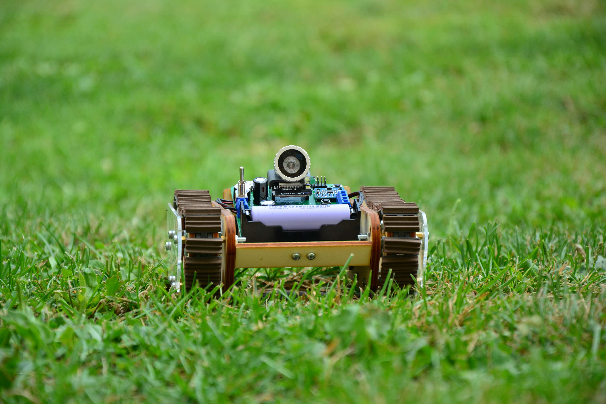
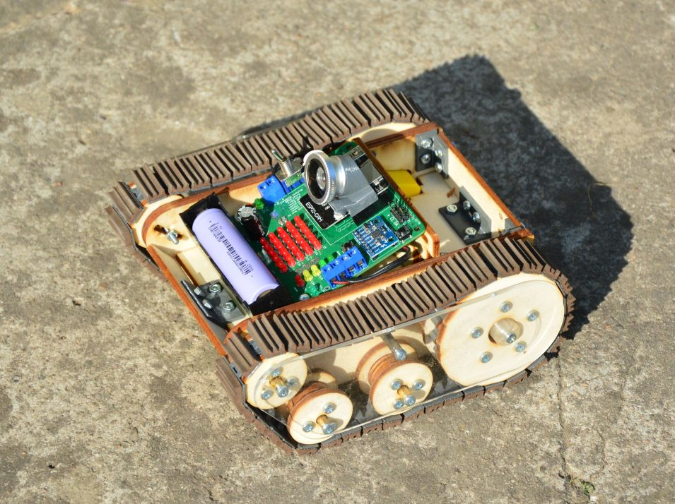
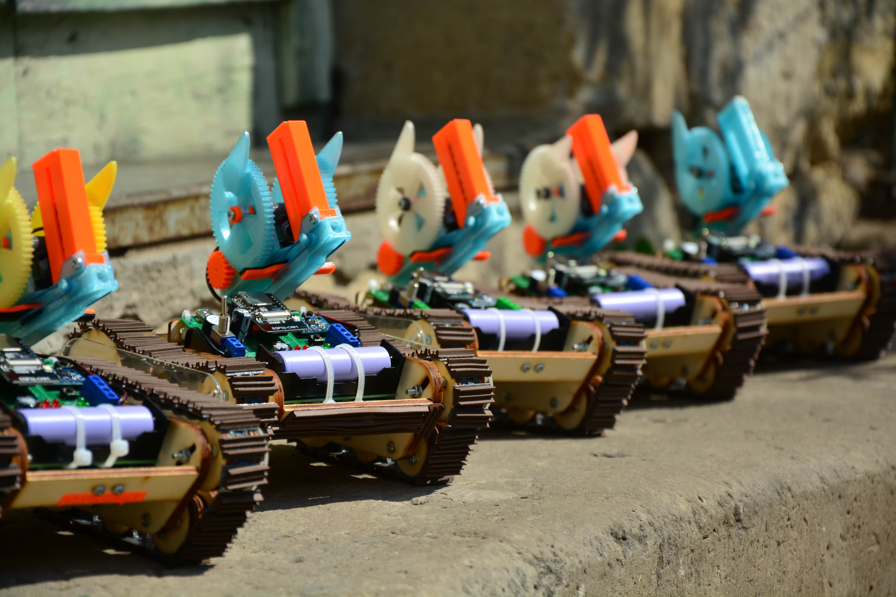
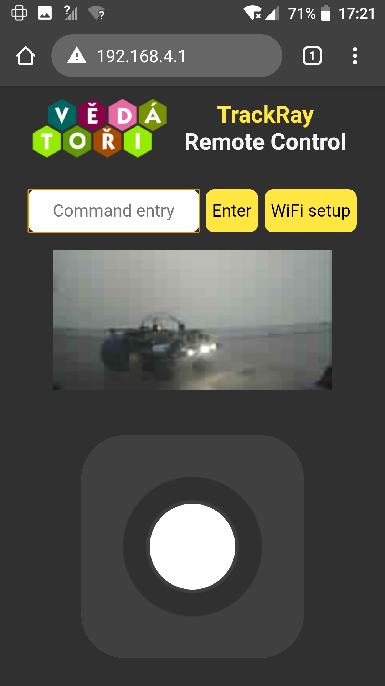

# TrackRay [cz]
TrackRay je otevřená platforma robotického vozidla. Byl vyvinut pro [Letní technické soustředění 2020](http://wp.vedatori.com/pobytove-tabory/), které se věnovalo robotice, elektronice, programování a mechanické stavbě. Tábor pořádal spolek [Vědátoři](http://vedatori.com/), hlavními vývojáři byli Martin Ptáček, Martin Coufal a Marek Coufal. Dále se na vývoji podíleli Aleš Kraml, Petr Vávra, Max Matějka a Tomáš Sajdl. Jedná se o pásové vozidlo, které je schopné se pohybovat ve vnitřních prostorech, ale i v mírnějším terénu.

Větší mechanické části jsou vyřezány z překližky a plexiskla na lasové řezačce, spojovací díly a menší části jsou vytištěné na FDM 3D tiskárnách. Spojování dílů je řešeno pomocí šroubů M3. Vozidlo má poháněná zadní kola, k tomu je použit běžně dostupný motor s převodovkou. Všechna kola jsou uložena bez vypružení. Pásy byly navrženy tak, aby je bylo možné vytisknout na 3D tiskárně s již hotovým kloubovým spojením mezi jednotlivými segmenty a tím se minimalizoval počet spojů, které musí být při stavbě zhotoveny.

Elektronika je soustředěna na jednu DPS. Její součástí je i běžně neodebíratelný akumulátor 18650, nabíjecí obvod a indikátor nabití. Do desky se vsazuje mikrokontrolér ESP32-CAM. Ten zajišťuje WiFi konektivitu a ovládání periferií, jako je například LED matice 5x5 určená pro komunikaci s okolím nebo bzučák. TrackRay obsahuje gyroskop, pomocí něhož lze dosáhnout velmi přesné jízdy. Obraz z kamery připojené k mikrokontroléru je přenášen tak, aby ho viděl operátor. 

Vozidlo je možné opakovaně přeprogramovat a periferie jsou zvoleny tak, aby si na nich mohli uživatelé vyzkoušet mnoho úloh, které rozvedou jejich schopnosti algorimizace a programování. Je vytvořen firmware pro dálkové ovládání přes WiFi. Ten umožňuje buďto ovládání pomocí WiFi, kterou vytvoří samotné vozidlo, nebo je možné jej připojit k běžné domácí síti. Ovládání je přizpůsobeno pro chytrá zařízení, na nichž se zobrazí joystick pro jízdu a také obraz přenášený z kamery. Dále je možné zadat speciální příkazy do příkazového řádku, pomocí nich je možné ovládat některé z periferií.

K TrackRay bylo vyvinuto i dělo, které střílí airsoftové kuličky a dřevěné špalíky. Jeho autorem je Jan Cícha.

## Licence
* Obsah tohoto repozitáře mimo složku *Software* je sdílen pod licencí [Attribution-NonCommercial-ShareAlike 4.0 International (CC BY-NC-SA 4.0)](https://creativecommons.org/licenses/by-nc-sa/4.0/).
* Obsah složky *Software* je sdílen pod licencí [GNU Lesser General Public License v3.0](https://www.gnu.org/licenses/lgpl-3.0.en.html).

# TrackRay [en]
TrackRay is an open-source robotic vehicle platform. It was developed for summer camp devoted to robotics, electronics, programming and mechanical assembly. The summer camp was organised by the [Vedatori](http://vedatori.com/) association. TrackRay was developed by Martin Ptáček, Martin Coufal and Marek Coufal as main developers, Aleš Kraml, Petr Vávra, Max Matějka and Tomáš Sajdl as associate developers.  This vehicle uses tracks that make it capable of both indooor and outdoor driving. 

Bigger mechanical parts were lasercut from plywood and PMMA. FDM 3D printers were used to manufacture smaller parts. Vehicle is assembled using M3 bolts. Rear wheels are driven by standard TT motors. Tracks are designed to be 3D printed in one piece with joints between segments. 

All electonic components are placed on a single PCB. It contains 18650 battery with a charger circuit and a charge level indicator. An ESP32-CAM microcontroller is used for WiFi connectivity and peripherials control. A 5x5 LED matrix, a buzzer and a gyroscope are present on the TrackRay PCB. With camera on, it is possible to drive without direct visual contact.

With used peripherials and option of reprogramming the vehicle it is suitable for gathering of new programming skills. Remote control uses WiFi in two modes - if there is no WiFi present, it is possible to use WiFi created by TrackRay microcontroller. It is also possible to connect TrackRay to common WiFi network. Control screen is designed for smartphones and contains joystick to control the robot, a camera stream and a command line to communicate with some of the peripherials.

Airsoft bullets blaster was deveoped as an optional accesory for TrackRay. Jan Cícha is main developer of the blaster.

## License
* The contents of this repository excluding folder *Software* is shared under license [Attribution-NonCommercial-ShareAlike 4.0 International (CC BY-NC-SA 4.0)](https://creativecommons.org/licenses/by-nc-sa/4.0/).
* The contents of the folder *Software* is shared under license [GNU Lesser General Public License v3.0](https://www.gnu.org/licenses/lgpl-3.0.en.html).

